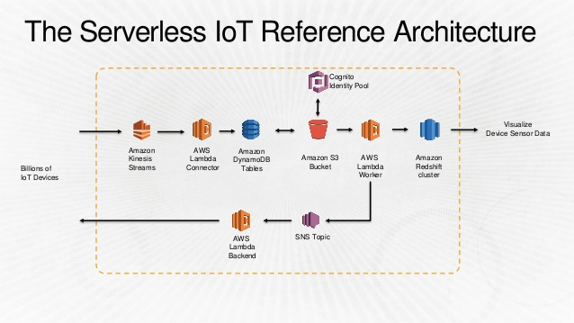
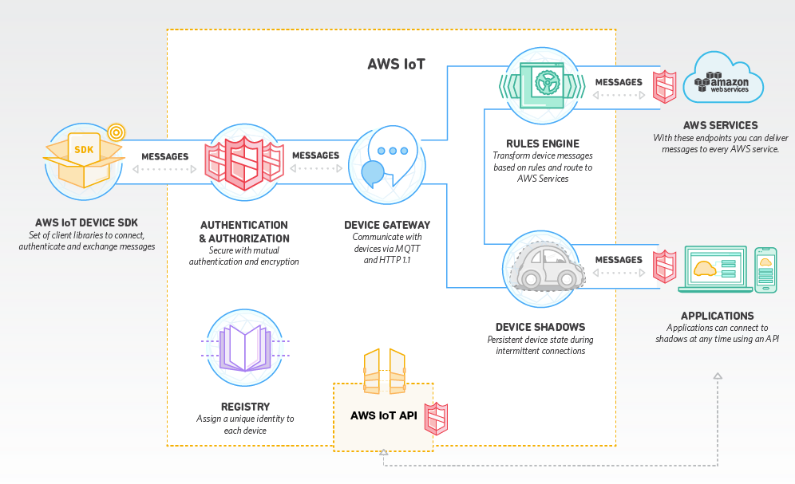
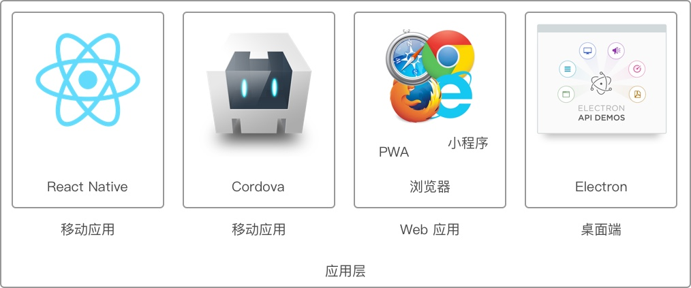

基于 JavaScript 语言的快速物联网开发架构
---

流行的原因：

 - 使用 WebView 开始 UI 方便，使得 WebView 随处可风
 - 事件驱动的编程模型
 - JavaScript 容易上手
 - React 等提供了可多的可能性

物联网架构
---

### 基于纯 JavaScript 的物联网架构

服务层
---

### 传统开发模式

### ServerLess

#### 通用的 ServerLess 架构 

#### AWS IoT Things

应用层
---

当有大量的图表显示时，Ionic 不失为一个不错的框架，并且可以和 Angular 2 配合使用

React Native 可以提供更好的性能

但是如果只能蓝牙的交互，可以考虑 PWA 或者微信小程序

硬件层
---

显然，就当前而言 Arduino 是最合适的原型开发硬件，除此还有 ESP8266

Tessel

Espruino

Ruff，配置

未来，IoT.js 会是一个更好的选择

协调层
---

Raspberry Pi

Johnny-Five 

OpenWRT 路由器作为网关

物联网的趋势
---

 - 微服务化
 - DevOps
 - 容器化
 - ServerLess
